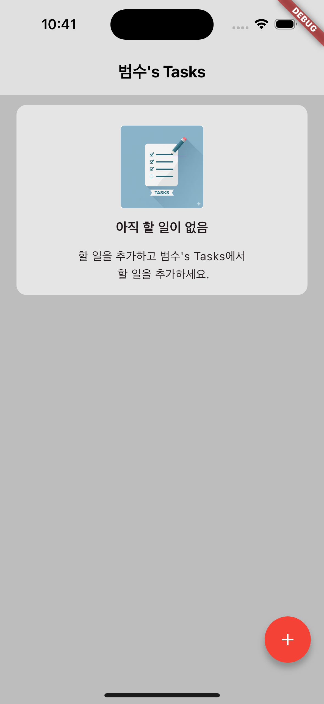
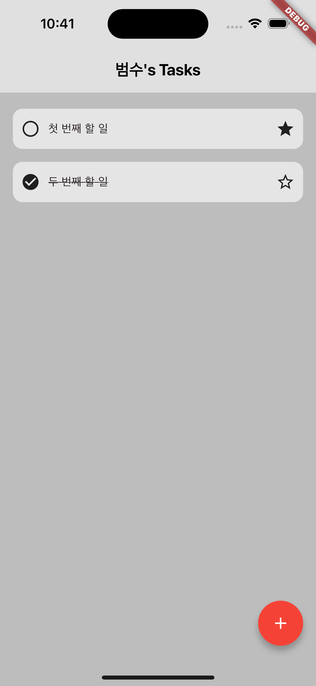
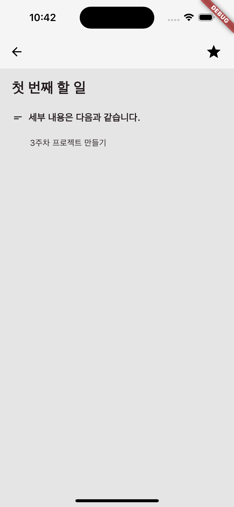
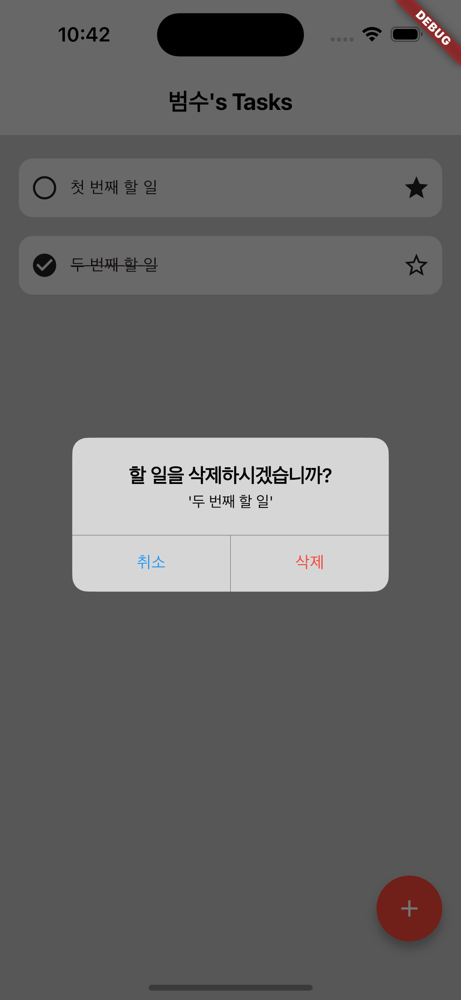

######이것은 3주차 개인 프로젝트입니다.######

Tasks 앱으로 할 일 목록을 만들고 관리할 수 있습니다.

### 홈 화면

 1. 앱의 홈 화면입니다.
 2. 할 일 목록이 비어있을 때 나타납니다.

### 할 일 추가 화면

 1. 할 일을 추가했을 때 화면입니다.
 2. 즐겨찾기 등록을 할 수 있고 완료 표시가 가능합니다.

### 세부 정보 화면

 1. 할 일을 길게 터치하면 description 화면으로 이동합니다.
 2. 할 일을 추가할 때 작성한 세부 내용을 확인할 수 있습니다.

### 삭제 알림창

 1. 할 일을 길게 누르면 삭제할 수 있습니다.
